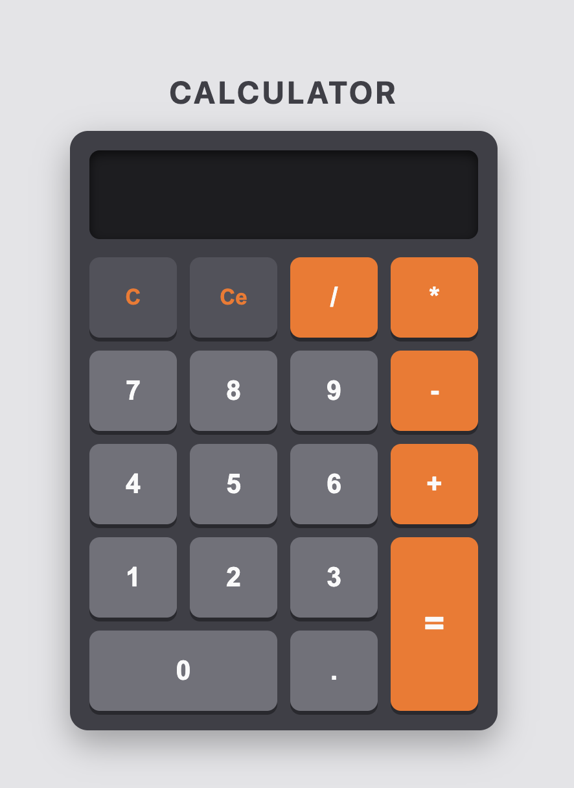

# # Calculator

A calculator built with vanilla JavaScript, HTML and CSS — no frameworks. Final project of The Odin Project's Foundations path.



## Live demo

[Live demo](https://facurubio.github.io/calculator/)

## Features

- Four basic operations: addition, subtraction, multiplication and division.
- Decimal input with validation (a number can't contain more than one decimal point).
- Backspace to delete the last character of the current operand.
- Full keyboard support (digits, operators, `.`, `Enter`, `Backspace`).
- Division by zero is handled and shows an error instead of breaking.

## Technical decisions

**Separating pure calculation from the UI.**
The code is split into two layers: pure calculation and UI. Three global variables (`A`, `B`, `C`) hold the values assigned from the UI, which are then consumed by the logic functions. I did this because the UI and the system logic should be agnostic of one another: the UI only handles interaction and passes along the data the system needs to do its work.

**A `flag` to tell a result apart from user input.**
There's a global `flag` variable I created to distinguish whether the value currently on the display is a generated result or a value typed by the user. It also means that when a value is entered while `flag` is `true`, the whole displayed value is replaced by the new input — because the result no longer needs to be kept around. It all comes down to the use case.

**Keyboard support by reusing the click logic.**
Keyboard support reuses the click logic instead of duplicating it. Since I designed everything around the `click` event from the start, making the `keydown` event trigger a click lets me reuse the same logic. I did it this way because in this project everything revolves around the UI and the calculator's usability — there was no need to refactor the whole codebase into functions that are agnostic of how the input is generated.

## Run locally

```bash
git clone https://github.com/facurubio/calculator.git
cd calculator
```

Then open `index.html` in your browser.

## Acknowledgments

Built as part of [The Odin Project](https://www.theodinproject.com/) — Foundations course.
